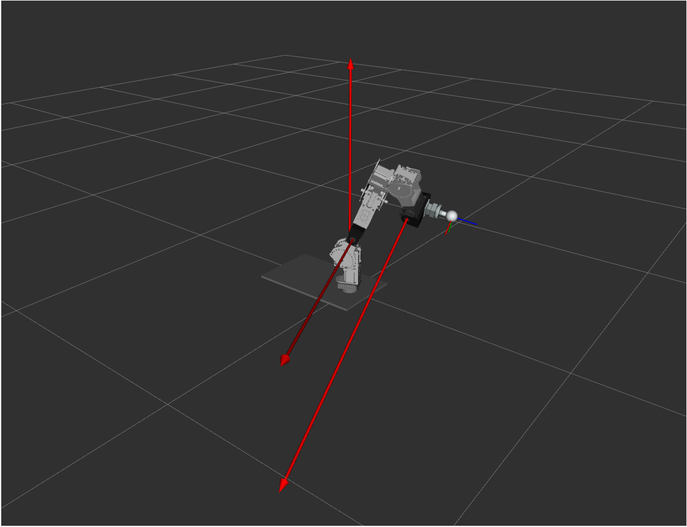
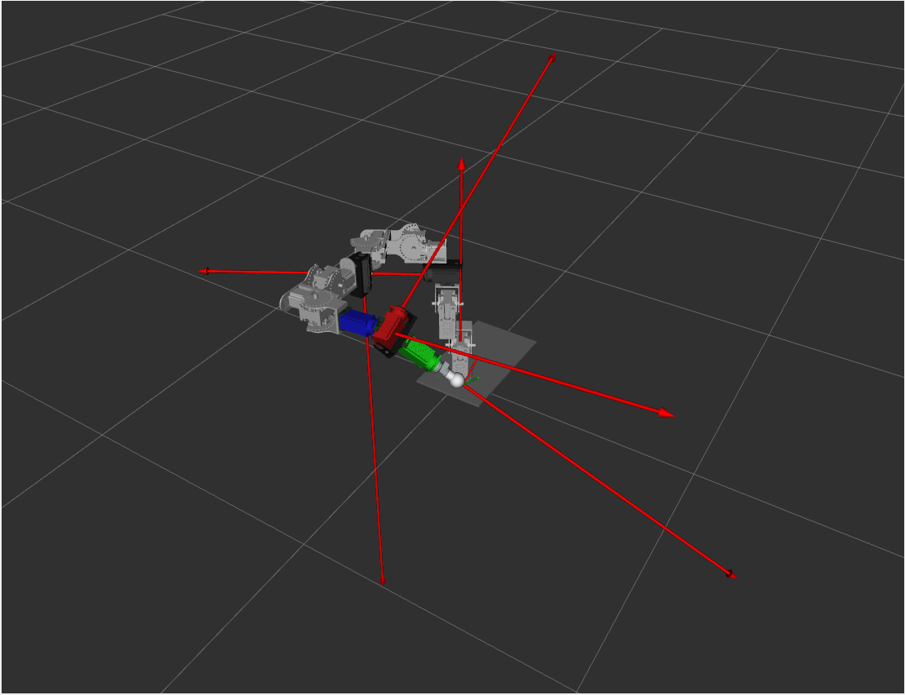

# smm_screws

Core screw theory library for Serial Metamorphic Manipulators (SMM) in ROS2.

## Overview

`smm_screws` implements screw-theory-based kinematics and dynamics for serial metamorphic manipulators.

The package is designed for ROS2, but can also be used as a standalone C++ library for robotics applications.

## Features

- Screw theory formulation (twists, adjoint transformations, exponentials)
- Analytical forward kinematics (stable)
- Partial dynamics implementation (under development)
- Support for 3-DOF and 6-DOF manipulators
- YAML-based robot structure loading
- Modular N-DOF implementation

## Important Notice

Use only the N-DOF implementation (`*Ndof.*` files).

Files without `Ndof`:
- are hardcoded for 3-DOF
- are deprecated
- will be removed in future versions

## Package Structure

```text
smm_screws/
├── include/smm_screws/core/   # Core class headers
├── src/core/                  # Core class implementations
├── config/                    # YAML robot data and parameters
├── launch/                    # ROS2 launch files
├── msg/                       # Custom ROS2 messages
├── srv/                       # Custom ROS2 services
├── action/                    # ROS2 actions
├── examples/                  # Minimal usage examples
├── demos/                     # Higher-level demonstrations
├── script/                    # Utility scripts
├── doc/                       # Documentation and media
├── CMakeLists.txt
├── package.xml
├── LICENSE
└── README.md
```

## API

A glimpse of the core API is provided below! 

### ScrewsMain

`ScrewsMain()` is he core lib for screw computation. It is not ROS-exclucive and can be used in broader cpp projects!

- `ScrewsMain()` — Initialize core screw-theory utility object  
- `formTwist(...)` — Build twist in vector or se(3) form  
- `splitTwist(...)` — Split twist into linear and angular parts  
- `vee(...)` — Convert se(3) matrix to 6D twist vector  
- `skew(...)` — Build skew-symmetric matrix from 3D vector  
- `unskew(...)` — Recover 3D vector from skew matrix  
- `crossProduct(...)` — Compute 3D vector cross product  
- `ad(...)` — Compute adjoint transformation matrix  
- `Ad(...)` — Compute spatial cross product  
- `iad(...)` — Compute inverse adjoint transformation matrix  
- `lb(...)` — Compute Lie bracket of two twists  
- `spatialCrossProduct(...)` — Build spatial cross-product matrix from twist  
- `adTwistVW(...)` — Alternative spatial cross-product operator for twists  
- `screwProduct(...)` — Compute screw product between two twists  
- `skewExp(...)` — Compute SO(3) exponential from axis-angle input  
- `twistExp(...)` — Compute SE(3) exponential from twist and angle  
- `extractRelativeTf(...)` — Compute relative transform between two frames  
- `extractLocalScrewCoordVector(...)` — Extract local screw coordinates from transform  
- `extractLocalScrewPrevCoordVector(...)` — Extract previous-frame local screw coordinates  
- `extract_twist_points(...)` — Extract two points defining twist axis  
- `extractRotationQuaternion(...)` — Extract quaternion from rotation transform  
- `createTwist(...)` — Create normalized twist from axis and point  
- `mergeColumns2Matrix(...)` — Merge twist columns into one 6xN matrix  

### ScrewsKinematicsNdof

`ScrewsKinematicsNdof` is the main N-DOF kinematics solver for serial metamorphic manipulators.

- `ScrewsKinematicsNdof(...)` — Construct N-DOF kinematics solver from robot model  
- `initializePseudoTfs()` — Initialize pseudo-joint anatomy transforms  
- `dof()` — Return active robot degrees of freedom  
- `updateJointState(...)` — Update joint positions, velocities, and accelerations  
- `setExponentials(...)` — Compute joint exponentials from reference twists  
- `setExponentialsAnat(...)` — Compute joint exponentials from anatomy twists  
- `initializeRelativeTfs()` — Initialize relative home transforms between frames  
- `initializeLocalScrewCoordVectors()` — Initialize local screw coordinates for joints  
- `initializeSpatialJointScrewCoordVectors()` — Initialize spatial screw coordinates for joints  
- `initializeReferenceAnatomyActiveTwists()` — Build reference anatomy active twists  
- `initializeReferenceAnatomyActiveTfs()` — Build reference anatomy home transforms  
- `initializeHomeAnatomyActiveTfs()` — Initialize home transforms for current anatomy  
- `getSpatialJointScrewCoordVector(...)` — Return spatial screw coordinate of joint  
- `ForwardKinematicsTCP(...)` — Compute TCP and joint frame forward kinematics  
- `updatePositionTCP(...)` — Return TCP Cartesian position  
- `getTcpPose()` — Return full TCP pose transform  
- `updateVelocityTCP(...)` — Return TCP linear velocity from spatial twist  
- `updateVelocityTCPHybrid(...)` — Return TCP linear velocity from hybrid twist  
- `updateAccelerationTCP(...)` — Return TCP linear acceleration from spatial twist  
- `updateAccelerationTCPHybrid(...)` — Return TCP linear acceleration from hybrid twist  
- `computeSpatialJacobianTCP1()` — Compute TCP spatial Jacobian, local-screw formulation  
- `computeSpatialJacobianTCP2()` — Compute TCP spatial Jacobian, reference-twist formulation  
- `computeSpatialJacobianTCP3()` — Compute TCP spatial Jacobian, PoE formulation  
- `computeBodyJacobianTCP1()` — Compute TCP body Jacobian, local-screw formulation  
- `computeBodyJacobianTCP2()` — Compute TCP body Jacobian, reference-twist formulation  
- `computeBodyJacobianTCP3()` — Compute TCP body Jacobian, PoE formulation  
- `getSpatialJacobianTCP()` — Return TCP spatial Jacobian  
- `getBodyJacobianTCP()` — Return TCP body Jacobian  
- `getJointFrame(...)` — Return requested joint or TCP frame  
- `computeBodyJacobiansFrames1()` — Compute body Jacobians for all frames, method 1  
- `computeBodyJacobiansFrames2()` — Compute body Jacobians for all frames, method 2  
- `getBodyJacobianFrame(...)` — Return one frame-specific body Jacobian column  
- `computeHybridJacobianTCP()` — Compute TCP hybrid Jacobian  
- `getHybridJacobianTCP()` — Return TCP hybrid Jacobian  
- `bodyToHybridJacobian(...)` — Convert body Jacobian to hybrid representation  
- `computeSpatialVelocityTwistTCP()` — Compute TCP spatial velocity twist  
- `computeBodyVelocityTwistTCP()` — Compute TCP body velocity twist  
- `getSpatialVelocityTwistTCP()` — Return TCP spatial velocity twist  
- `getBodyVelocityTwistTCP()` — Return TCP body velocity twist  
- `computeDtSpatialVelocityTwistTCP()` — Compute TCP spatial acceleration twist  
- `computeDtBodyVelocityTwistTCP()` — Compute TCP body acceleration twist  
- `getDtSpatialVelocityTwistTCP()` — Return TCP spatial acceleration twist  
- `getDtBodyVelocityTwistTCP()` — Return TCP body acceleration twist  
- `computeHybridVelocityTwistTCP()` — Compute TCP hybrid velocity twist  
- `getHybridVelocityTwistTCP()` — Return TCP hybrid velocity twist  
- `getHybridLinearVelocityTCP()` — Return TCP hybrid linear velocity  
- `getHybridAngularVelocityTCP()` — Return TCP hybrid angular velocity  
- `computeDtHybridVelocityTwistTCP()` — Compute TCP hybrid acceleration twist  
- `getDtHybridVelocityTwistTCP()` — Return TCP hybrid acceleration twist  
- `getHybridLinearAccelerationTCP()` — Return TCP hybrid linear acceleration  
- `getHybridAngularAccelerationTCP()` — Return TCP hybrid angular acceleration  
- `computeDtSpatialJacobianTCP1()` — Compute time derivative of spatial Jacobian  
- `getDtSpatialJacobianTCP()` — Return time derivative of spatial Jacobian  
- `computeDtBodyJacobianTCP1()` — Compute body Jacobian derivative, method 1  
- `computeDtBodyJacobianTCP2()` — Compute body Jacobian derivative, method 2  
- `computeDtBodyJacobianTCP3()` — Compute body Jacobian derivative, method 3  
- `getDtBodyJacobianTCP()` — Return time derivative of body Jacobian  
- `computeDtHybridJacobianTCP()` — Compute time derivative of hybrid Jacobian  
- `getDtHybridJacobianTCP()` — Return time derivative of hybrid Jacobian  
- `getOperationalJacobianTCP()` — Return operational-space TCP Jacobian  
- `hasOperationalJacobianTCP()` — Check whether operational Jacobian is valid  
- `computeBodyCOMJacobiansFrames()` — Compute body Jacobians of the link COM frames 
- `ForwardKinematicsCOM()` — Compute forward kinematics of all real-link COM frames using the internally stored joint state  
- `getOperationalJacobianTCP()` — Return operational-space TCP Jacobian  
- `hasOperationalJacobianTCP()` — Check whether operational Jacobian is valid  
- `getDtOperationalJacobianTCP()` — Return time derivative of the operational-space TCP Jacobian  
- `hasDtOperationalJacobianTCP()` — Check whether time-derivative operational Jacobian is valid  
- `computeAbMatrix()` — Build the strict lower-triangular Mueller body block matrix \(A^b\)  
- `computeabMatrix()` — Build the block-diagonal Mueller body matrix \(a^b\) from joint velocities and local body screws  
- `computebbMatrix()` — Build the block-diagonal Mueller body matrix \(b^b\) from stacked body twists  
- `stackBodyJacobiansFrames()` — Stack all real-frame body Jacobians into a single \((6n \times n)\) matrix  
- `stackBodyTwistsFrames()` — Stack all real-frame body twists into a single \((6n \times 1)\) vector  

### ScrewsDynamicsNdof

`ScrewsDynamicsNdof` extends `ScrewsKinematicsNdof` with N-DOF rigid-body dynamics.

- `ScrewsDynamicsNdof(...)` — Construct N-DOF dynamics solver from robot model  
- `dof()` — Return active robot degrees of freedom  
- `updateJointPos(...)` — Update joint positions and store previous position / delta position history  
- `updateJointVel(...)` — Update joint velocities  
- `updateJointState(...)` — Update joint positions and velocities  
- `updateJointState(...)` — Update joint positions, velocities, and accelerations  
- `MassMatrix(...)` — Compute joint-space mass matrix in spatial or body form  
- `CoriolisMatrix(...)` — Compute joint-space Coriolis / centrifugal matrix  
- `GravityVector(...)` — Compute joint-space gravity vector  
- `OperationalMassMatrix(...)` — Compute nonredundant operational-space inertia matrix  
- `OperationalGravityVector(...)` — Compute nonredundant operational-space gravity vector  
- `OperationalCoriolisVector(...)` — Compute nonredundant operational-space Coriolis / bias velocity vector  
- `initializeLinkMassMatrices()` — Initialize link spatial inertia matrices from the robot model  
- `MassMatrix_s(...)` — Compute spatial-form joint-space mass matrix  
- `MassMatrix_b(...)` — Compute body-form joint-space mass matrix  
- `CoriolisMatrix_s()` — Compute spatial-form joint-space Coriolis matrix  
- `CoriolisMatrix_b()` — Compute body-form joint-space Coriolis matrix  
- `GravityVector_s()` — Compute spatial-form joint-space gravity vector  
- `GravityVector_b()` — Compute body-form joint-space gravity vector  
- `extractLinkMassFromSpatialInertia(...)` — Extract scalar link mass from the stored spatial inertia matrix  
- `computeLinkGeometricJacobians()` — Compute full geometric Jacobians of all real-link CoM frames  
- `updateCOMTfs()` — Update current CoM transforms of all real links  
- `computeAlphaMatrixAnat(...)` — Compute anatomy-based Alpha adjoint matrix used in dynamic formulations  
- `computeParDerMassElement(...)` — Compute one partial derivative element of the mass matrix  
- `computeBodyInertiaFromSpatial(...)` — Transform spatial inertias to selected body-frame inertias  
- `extractSquareOperationalJacobian()` — Extract the square operational Jacobian used in nonredundant operational-space dynamics  
- `computeOperationalJacobianDerivativeTimesVelocity()` — Compute \(\dot{J}_{op} \dot{q}\) for operational-space dynamics  

### RobotAbstractBaseNdof

`RobotAbstractBaseNdof` defines the abstract robot model interface and stores the loaded kinematic, geometric, and inertial data used by the N-DOF screw-theory solvers. The robot reconfigurable architecture is encoded through predefined C++ structure classes, each representing a valid topology allowed by the SMM structuring rules.

- `RobotAbstractBaseNdof()` — Construct empty abstract robot base  
- `RobotAbstractBaseNdof(...)` — Construct abstract base with YAML path  
- `get_DOF()` — Return loaded robot degrees of freedom  
- `initializeFromYaml(...)` — Load robot model data from YAML files  
- `get_STRUCTURE_ID()` — Return predefined structure identifier  
- `get_PSEUDOS_METALINK1()` — Return pseudojoint count in metalink 1  
- `get_PSEUDOS_METALINK2()` — Return pseudojoint count in metalink 2  
- `get_PSEUDOS_METALINK3()` — Return pseudojoint count in metalink 3  
- `get_PSEUDO_ANGLE(...)` — Return pseudojoint angle by index  
- `get_PASSIVE_TWIST(...)` — Return passive twist by index  

### Predefined structure classes

The following concrete classes implement the same `RobotAbstractBaseNdof` interface and differ only in the predefined valid SMM structure they represent:

- `FixedStructureNdof` — Fixed structure with no pseudojoints  
- `Structure2PseudosNdof` — Structure containing 2 pseudojoints  
- `Structure3PseudosNdof` — Structure containing 3 pseudojoints  
- `Structure4PseudosNdof` — Structure containing 4 pseudojoints  
- `Structure5PseudosNdof` — Structure containing 5 pseudojoints  
- `Structure6PseudosNdof` — Structure containing 6 pseudojoints  

### RobotYamlLoaderNdof

`RobotYamlLoaderNdof` loads user-defined YAML files and assembles the variable-size N-DOF robot data required by the internal screw-theory robot model.

- `RobotYamlLoaderNdof()` — Construct empty YAML loader  
- `RobotYamlLoaderNdof(...)` — Construct YAML loader with base path  
- `setBasePath(...)` — Set directory containing robot YAML files  
- `loadAll()` — Load complete robot model from YAML files  
- `loadMatrix4f(...)` — Load 4x4 transform matrix from YAML  
- `loadTwist6f(...)` — Load 6D twist vector from YAML  
- `loadMatrix6x6f(...)` — Load 6x6 matrix from YAML  

### RobotContextNdof

`RobotContextNdof` is a lightweight integration class that bundles the robot model and the N-DOF solver layer into a single working context.

- `RobotContextNdof(...)` — Construct context from robot model instance  
- `initializeSharedLib()` — Initialize shared robot-solver context  
- `get_kinematics()` — Return access to N-DOF kinematics solver  
- `get_robot()` — Return access to robot model  

## Examples

### RViz Visualization




## References and Acknowledgments

This package builds upon established work in screw theory and multibody systems. The code implements and adapts the theoretical formulations of these works to support
serial metamorphic manipulators (SMM) with reconfigurable structure in an N-DOF ROS2 framework.

[1] R. M. Murray, Z. Li, S. S. Sastry,  
*“A Mathematical Introduction to Robotic Manipulation”*,  
CRC Press, 1994.

[2] A. Müller,  
*“Screw and Lie group theory in multibody kinematics: Motion representation and recursive kinematics of tree-topology systems”*,  
Multibody System Dynamics, 43(1), 37–70, 2018.

[3] A. Müller,  
*“Screw and Lie group theory in multibody dynamics: Recursive algorithms and equations of motion of tree-topology systems”*,  
Multibody System Dynamics, 42(2), 219–248, 2018.

## License

This project is licensed under the BSD 3-Clause License.
